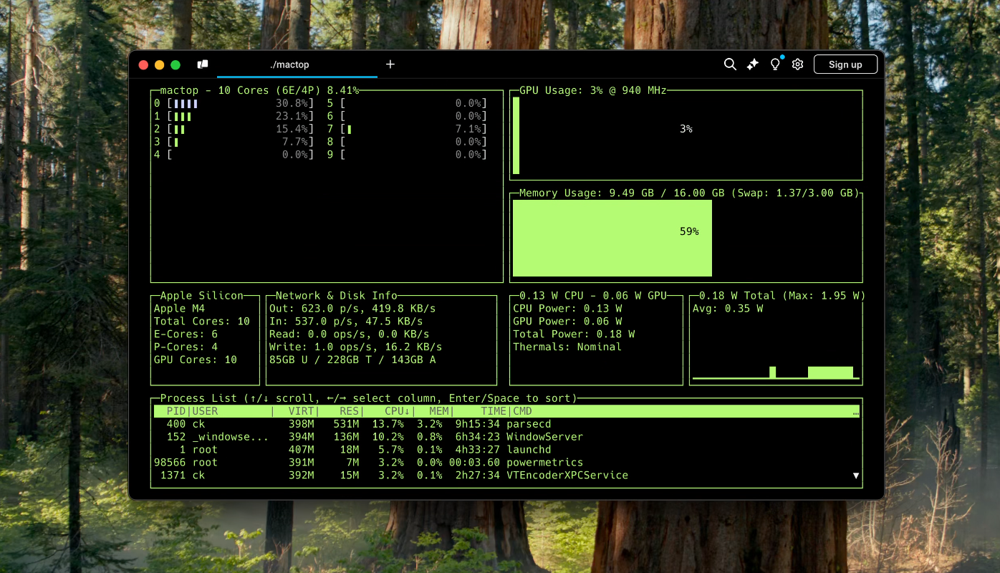

# mactop

 

`mactop` is a terminal-based monitoring tool "top" designed to display real-time metrics for Apple Silicon chips written by Carsen Klock. It provides a simple and efficient way to monitor CPU and GPU usage, E-Cores and P-Cores, power consumption, and other system metrics directly from your terminal!


## Compatibility

- Apple Silicon Only (ARM64)
- macOS Monterey 12.3+

## Features

- Apple Silicon Monitor Top written in Go Lang and CGO
- Real-time CPU, GPU, and ANE power wattage usage display.
- Detailed native metrics for CPU cores (E and P cores) (Apple's Mach Kernel API)
- Memory usage and swap information.
- Network usage information
- Disk Activity Read/Write
- Easy-to-read terminal UI
- Two layouts: default and alternative
- Customizable UI color (green, red, blue, cyan, magenta, yellow, and white)
- Customizable update interval (default is 1000ms)
- Processes list (sorted by CPU usage)
- Disk Storage (Used, Total, Available)
- Party Mode (Randomly cycles through colors)
- Optional Prometheus Metrics server (default is disabled)
- Support for all Apple Silicon models.

## Install via Homebrew

You can install [mactop](https://github.com/context-labs/mactop) via Homebrew! https://brew.sh

```bash
brew install mactop
```

```bash
sudo mactop
```

## Updating via Homebrew

```bash
brew update
```

```bash
brew upgrade mactop
```

## Installation

To install `mactop`, follow these steps:

1. Ensure you have Go installed on your machine. If not, you can install it by following the instructions here: [Go Installation Guide](https://go.dev/doc/install).

2. Clone the repository:
   ```bash
   git clone https://github.com/context-labs/mactop.git
   cd mactop
   ```

3. Build the application:
   ```bash
   go build
   ```

4. Run the application:
   ```bash
   sudo ./mactop
   ```

## Usage

After installation, you can start `mactop` by simply running:
```bash
sudo ./mactop
```

`sudo` is required to run `mactop`

Example with flags
```bash
sudo mactop --interval 1000 --color green
```

## mactop Flags

- `--interval` or `-i`: Set the powermetrics update interval in milliseconds. Default is 1000. (For low-end M chips, you may want to increase this value)
- `--color` or `-c`: Set the UI color. Default is white. 
Options are 'green', 'red', 'blue', 'cyan', 'magenta', 'yellow', and 'white'. (-c green)
- `--prometheus` or `-p`: Set and enable the local Prometheus metrics server on the given port. Default is disabled. (e.g. -p 2112 to enable Prometheus metrics on port 2112)
- `--version` or `-v`: Print the version of mactop.
- `--help` or `-h`: Show a help message about these flags and how to run mactop.

## mactop Commands
Use the following keys to interact with the application while its running:
- `q`: Quit the application.
- `r`: Refresh the UI data manually.
- `c`: Cycle through the color themes.
- `p`: Party Mode (Randomly cycles through colors)
- `l`: Toggle the main display's layout.
- `h`: Toggle the help menu.

## Example Theme (Green) Screenshot (sudo mactop -c green) on Advanced layout (Hit "l" key to toggle)



## Confirmed tested working M series chips

- M1
- M1 Pro
- M1 Max
- M1 Ultra
- M2
- M2 Pro
- M2 Max
- M2 Ultra
- M3
- M3 Pro
- M3 Max
- M3 Ultra
- M4
- M4 Pro
- M4 Max
- M5

(If you have a confirmed working M series chip that is not listed, please open an issue, so we may add it here!)

## Contributing

Contributions are what make the open-source community such an amazing place to learn, inspire, and create. Any contributions you make are **greatly appreciated**.

1. Fork mactop
2. Create your Feature Branch (`git checkout -b feature/AmazingFeature`)
3. Commit your Changes (`git commit -m 'Add some AmazingFeature'`)
4. Push to the Branch (`git push origin feature/AmazingFeature`)
5. Open a Pull Request

## What does mactop use to get real-time data?

- `sysctl`: For CPU model information
- `system_profiler`: For GPU Core Count
- `psutil`: For memory and swap metrics
- `powermetrics`: For majority of GPU, Network, and Disk metrics
- `host_processor_info`: For CPU metrics (E and P cores) Apple Mach Kernel API in CGO

## License

Distributed under the MIT License. See `LICENSE` for more information.

## Author and Contact

Carsen Klock - [@carsenklock](https://x.com/carsenklock)

Project Link: [https://github.com/context-labs/mactop](https://github.com/context-labs/mactop)

## Disclaimer

This tool is not officially supported by Apple. It is provided as is, and may not work as expected. Use at your own risk.

## Acknowledgements

- [termui](https://github.com/gizak/termui) for the terminal UI framework.
- [gopsutil](https://github.com/shirou/gopsutil) for system memory monitoring.
- [asitop](https://github.com/tlkh/asitop) for the original inspiration!
- [htop](https://github.com/htop-dev/htop) for the process list and CPU cores inspiration!
