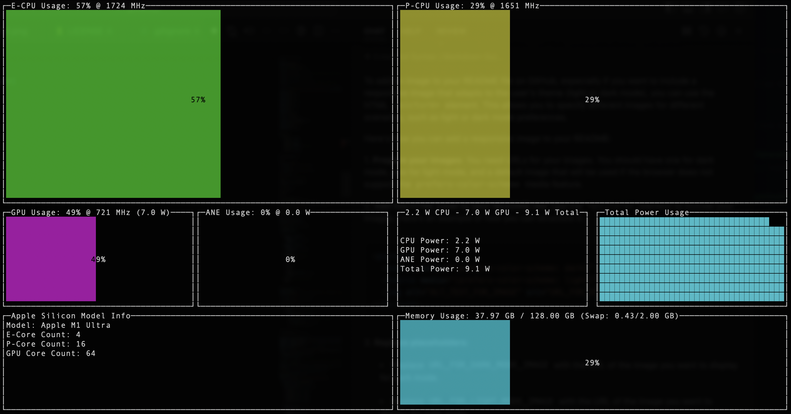

# goasitop

`goasitop` is a terminal-based monitoring tool "top" designed to display real-time power metrics for Apple Silicon chips. It provides a simple and efficient way to monitor CPU and GPU usage, E-Cores and P-Cores, power consumption, and other system metrics directly from your terminal!



## Features

- Apple Silicon Monitor Top written in Go Lang (Under 1,000 lines of code)
- Real-time CPU and GPU power usage display.
- Detailed metrics for different CPU clusters (E-Cores and P-Cores).
- Memory usage and swap information.
- Network usage information and Disk Activity Read/Write
- Easy-to-read terminal UI
- Support for all Apple Silicon models.

## Install via Homebrew

```bash
brew tap context-labs/goasitop https://github.com/context-labs/goasitop
```

```bash
brew install goasitop
```

```bash
sudo goasitop
```

## Installation

To install `goasitop`, follow these steps:

1. Ensure you have Go installed on your machine. If not, you can install it by following the instructions here: [Go Installation Guide](https://go.dev/doc/install).

2. Clone the repository:
   ```bash
   git clone https://github.com/context-labs/goasitop.git
   cd goasitop
   ```

3. Build the application:
   ```bash
   go build
   ```

4. Run the application:
   ```bash
   ./goasitop
   ```

## Usage

After installation, you can start `goasitop` by simply running:
```bash
./goasitop
```

Use the following keys to interact with the application:
- `q`: Quit the application.
- `r`: Refresh the UI data manually.

## Contributing

Contributions are what make the open-source community such an amazing place to learn, inspire, and create. Any contributions you make are **greatly appreciated**.

1. Fork goasitop
2. Create your Feature Branch (`git checkout -b feature/AmazingFeature`)
3. Commit your Changes (`git commit -m 'Add some AmazingFeature'`)
4. Push to the Branch (`git push origin feature/AmazingFeature`)
5. Open a Pull Request

## License

Distributed under the MIT License. See `LICENSE` for more information.

## Contact

Carsen Klock - [@carsenklock](https://twitter.com/carsenklock)

Project Link: [https://github.com/context-labs/goasitop](https://github.com/context-labs/goasitop)

## Acknowledgements

- [termui](https://github.com/gizak/termui) for the terminal UI framework.
- [gopsutil](https://github.com/shirou/gopsutil) for system memory monitoring.
- [asitop](https://github.com/tlkh/asitop) for the original inspiration!
